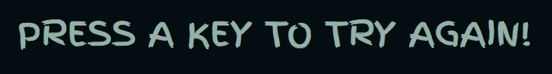
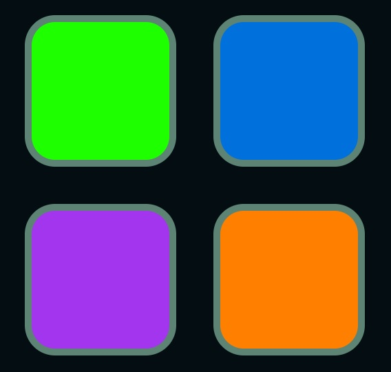
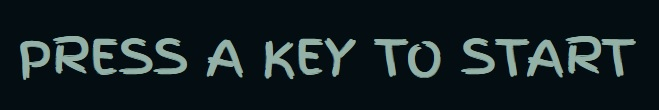
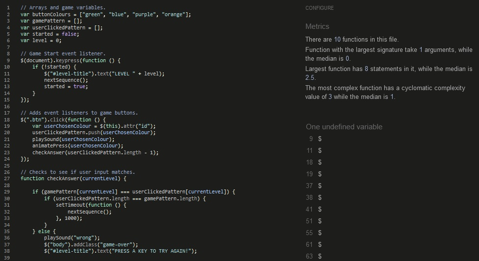

# Simon Says

Lucky Dice is a basic dice rolling game! Once the page loads you will be given a random dice roll between 1 and 6, and the computer opponent will be given the same! Who will win in this game of purest chance? Are you feeling lucky!?

The Lucky Dice site is live and is currently hosted [HERE!](https://marc-hanson.github.io/challenge-one/)

## Features

The game was styled with a feeling for the wild west and gambling in an old timey saloon. The fonts chosen: 'Rye' and 'Smokum' both push that theme as well as a sunset color palette of yellows, oranges and browns.

### Existing Features

- **The Heading**

  - Featured at the top of the page, the heading is used to welcome the user to the page. Once the dice have been rolled the heading will display the winner or loser of the game.

- **The Game Area**

  - This section will display the outcomes of both the players dice and your opponents dice.

- **Instructions**

  - This section gives the user playing instructions and the rules of the game.

For some/all of your features, you may choose to reference the specific project files that implement them.

In addition, you may also use this section to discuss plans for additional features to be implemented in the future:

### Features Left to Implement

- Scoreboard
- Event Listeners to allow a click on the dice instead of page refresh.

## Testing

- The website was constantly tested during development using Chrome development tools.
- Javascipt was ran after every new function to ensure it was behaving as intended.
- Website tested in Chrome, Firefox and Microsoft Edge.
- Website was tested across a range of devices including laptops, tablets and mobiles.

### Testing During Development

- A random number variable was created for the player and opponent and tested with 'console.log()'.
- The images were then updated using this result and tested on a 'python3 http.server'.
- The final game was pushed to github and tested on multiple devices, all file paths began with a / which resulted in links between Javascript and CSS pages as well as images to display not working correctly. This was later fixed.

### Validator Testing

- HTML
  - HTML pages passed validation on W3C.  
    
- CSS
  - CSS page passed validation on W3C.  
    
- LIGHTHOUSE
  - Prefect scores across Lighthouse.  
    
- JSHINT
  - All Javascript passed through JSHint, unused functions are ran through the HTML onclick property. ES8 warnings are due to async functions being used in most of the games functions.  
    

### Unfixed Bugs

None.

## Technologies Used

### Main Languages Used

- HTML5
- CSS3
- Javascript

### Frameworks, Libraries & Programs Used

- Am I Responsive? - to ensure the project looked good across all devices.
- CodeAnywhere - was the chosen IDE to write both HTML and CSS before pushing the project to Github.
- GitHub - to import the CodeInstitute template from and to store my repository.
- VSCode - used to keep work on local versions of the site.

## Deployment

### Using GitHub Pages

Github Repository or project - <https://marc-hanson.github.io/challenge-one/>

1. Click the 'Settings' Tab.
2. Scroll Down to the Git Hub Pages Heading.
3. Select 'Main Branch' as the source.
4. The Page will reload 'Settings' again.
5. Scroll to GitHub pages heading and there will now be a clickable link <https://marc-hanson.github.io/challenge-one/>
6. Click the link for the live deployed page.

### Fork Project

1. On GitHub, go to [marc-hanson/challenge-one/](https://marc-hanson.github.io/challenge-one/).
2. In the top right, click "Fork".

### Clone Project

1. Go to the main page of the repository.
2. Above the file list, click "Code".
3. Select HTTPS, SSH, or GitHub CLI and then click copy to clone it.
4. Open Git Bash.
5. Change the location of your cloned repository.
6. Type `git clone` and then paste the URL you copied.
7. Press “Enter” to create you

## Credits

- All images used on this site were taken from [Pixabay](https://pixabay.com/users/clker-free-vector-images-3736/)
- Color palette was taken from Colorhunt.io
- The inspiration for this site is taken from Angela Yu's The Complete 2023 Web Development Bootcamp on Udemy.

[Back to top](#lucky-dice)
